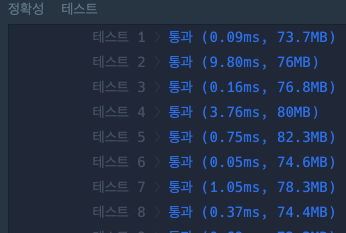

**정수 제곱근 판별**

문제 설명

임의의 양의 정수 n에 대해, n이 어떤 양의 정수 x의 제곱인지 아닌지 판단하려 합니다.
n이 양의 정수 x의 제곱이라면 x+1의 제곱을 리턴하고, n이 양의 정수 x의 제곱이 아니라면 -1을 리턴하는 함수를 완성하세요.

##### 제한 사항

* n은 1이상, 50000000000000 이하인 양의 정수입니다.

##### 입출력 예

| n   | return |
| --- | ------ |
| 121 | 144    |
| 3   | -1     |

###### 입출력 예 설명

**입출력 예#1**
121은 양의 정수 11의 제곱이므로, (11+1)를 제곱한 144를 리턴합니다.

**입출력 예#2**
3은 양의 정수의 제곱이 아니므로, -1을 리턴합니다.

---


## 풀었던 코드 

```java
class Solution {
    public long solution(long n) {
        // if(i * i = n)
        //return (i+1)^2
        long answer = 1;
  
        while(true) {
            if(answer * answer == n){
                return (answer+1)*(answer+1);
            }
            else if(answer * answer > n) {
                return -1;
            }
            answer ++;
        }   
    }
}
```



통과는 되었지만 O(n)... 성능이 매우 안좋음 ..

---

## 개선

자바에서 제공하는 Math API를 이용

```java
class Solution {
  public long solution(long n) {
      if (Math.pow((int)Math.sqrt(n), 2) == n) {
            return (long) Math.pow(Math.sqrt(n) + 1, 2);
        }

        return -1;
  }
}
```

처리 속도가 0.2ms 아래였다.

- Math.pow(a,b) : a^b 의 값 반환
- Math.sqrt(n) : n의 제곱근 반환
