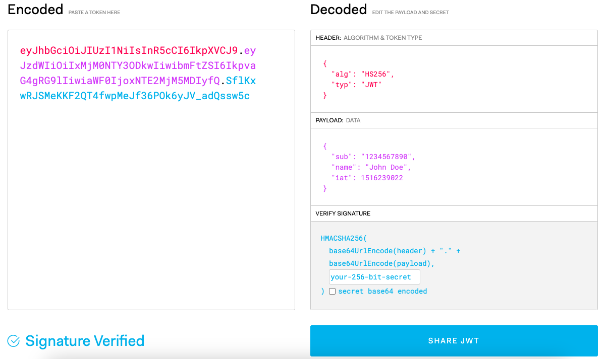

# 로그인 인증을 위한 다양한 인증 방식 / 로그인 방식이 존재

1. ID/PW 기반 로그인
2. 소셜 로그인(Oauth2)
3. 이메일 인증
4. 휴대폰 인증
5. MFA

## HTTP SESSION

HTTP 세션은 웹App 에서 사용자 정보를 저장하는 기술.
세션은 웹앱에 접속 후, 일정 시간 동안 유지되는 정보

특징:
1. HTTP 프로토콜은 Stateless 함. 사용자가 다시 요청을 보낼 때 마다 사용자 정보를 매번 다시 전송해야한다. 이 문제를 해결하기위해 세션은 사용자 정보를 서버측에서 저장하고 관리하는 세션 ID를 발급한다.
2. HTTP 세션은 쿠키를 사용하여 구현한다.
3. HTTP 세션은 사용자 로그인 정보를 관리 할 때 사용하며, 사용자가 다시 접속 하여도 유지 된다.
4. HTTP 세션은 서버에서 관리하기 때문에 사용자가 임의로 세션 정보 조작을 할 수 없다. 해당 값은 랜덤 값으로 생성되며, HTTPS를 통해 암호화 된다.

인증 과정:
1. 유저 로그인 시도
2. 서버가 인증정보 검증해서 session ID 생성
3. 세션은 서버측에서 관리, 서버에서 갱신 및 정보를 변경 가능
4. 세션 ID가 쿠키 방식으로 유저에게 전달 되며 웹앱에서 사용한다.

## HTTP Cookie
HTTP 쿠키는 웹 브라우저, 웹서버 간 상태 정보를 유지하기 위한 기술.
쿠키는 서버가, 브라우저는 로컬에 저장하고 필요할 시 서버에 전송해 사용자 상태정보를 유지.

쿠키는 HTTP 헤더에 Set-Cookie와 같은 헤더를 통해 서버에서 클라이언트로 전송 됨.
쿠키는 키-값 구성, 이름, 값, 유효기간, 도메인, 경로 등 정보를 포함한다.

### 특징 : 
1. 쿠키는 클라이언트 측에 저장된다. 서버에서 클라이언트 상태정보를 확인하려면 쿠키를 클라이언트로 부터 전송 받아야한다.
2. 쿠키는 유효기간이 있다. 유효기간이 끝나면 삭제된다.
3. 보안 문제가 있다. HTTPS와 같은 보안 프로토콜로 암호화를 해야한다.
4. 쿠키는 브라우저에서 관리되기에 브라우저에서 쿠키 삭제, 다른 브라우저 접속 시 쿠키는 공유되지 않는다.

### 쿠키 인증 과정:
1. 유저가 로그인 정보 입력
2. 서버가 사용자 정보 검증, 인증 성공 시 사용자 고유ID+인증 토큰(쿠키)를 생성
3. 인증된 토큰을 HTTP 응답 헤더에 포함해 클라이언트에게 전송
4. 클라이언트는 전송 받은 인증 토큰(쿠키)를 로컬에 저장
5. 클라이언트가 서버에 요청을 보낼 때 마다 인증 토큰(쿠키)를 HTTP 요청 헤더에 포함해 전송
6. 서버는 전송받은 인증 토큰(쿠키)를 검증, 인증 성공 시 필요 요청에 응답 생성

## HTTP Header
서버와 클라이언트 간의 인증을 HTTP 헤더를 통해 수행하는 방식
Http Basic, Http Digest, Oauth 같은 프로토콜로 구현되는게 일반적
그 외엔 특정 Header(커스텀이겠지)에 토큰을 넣어 사용지 인식, 인증 한다.

## JWT Token
JWT(JSON Web Token), 데이터를 JSON 객체를 사용해 가볍고 안전 히 전달 할 수 있는 토큰 인증 방식.
jwt 는 url,http header, html form 같은 다양한 방식으로 전달 가능, 서버-클라이언트 간 인증 정보를 포함한다.

JWT는 Header,Payload,Signature 세 부분으로 구성

Header는 JWT 타입, 암호화 알고리즘 정보를 JSON 형식으로 Base64으로 인코딩 된다.

Payload는 클레임 정보를 포함 해 JSON 형식으로 Base64방식으로 인코딩 된다.
클레임 정보는 사용자 ID, 권한 등을 포함 할 수 있다.

* 하지만 이것들은 간단한 Base64 Decoding 사이트에 가면 누구나 분석 가능 하니 중요한 정보는 넣으면 안된다.

Signature는 헤더,페이로드를 조합 후 비밀 키를 사용해 생성 된 서명 값이다.
서명 값은 토큰의 무결성을 보장하며, JWT를 조작하지 않음을 검증한다.

Signature = (인코딩 된 헤더),(인코딩 된 페이로드),비밀 키
Hash 암호화를 통해 Signature를 암호화 한 값을 Base64로 인코딩한 것이다.

** 결론 : 비밀 키를 알아야 Signature를 알 수 있다. 그러므로 토큰의 무결성을 보장 할 수 있다.

