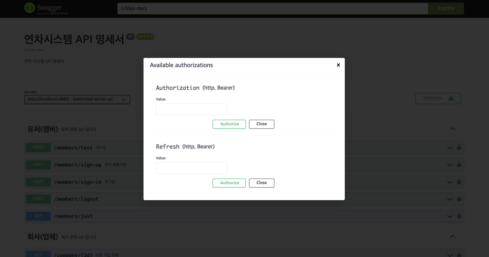

# implementation 'org.springdoc:springdoc-openapi-starter-webmvc-ui:2.2.0' 
위 버전 기준하에 작성 함 

@Configuration
@OpenAPIDefinition(
        info = @io.swagger.v3.oas.annotations.info.Info(title = "연차시스템 API 명세서",
        description = "연차 시스템 API 명세서", version = "v1")
)
public class SwaggerConfig {
    // 스웨거 주소 : http://localhost:4860/swagger-ui/index.html#/

    @Bean
    public OpenAPI openAPI() {
        // FIXME
        //  참고 https://velog.io/@juhyeon1114/Springdoc%EC%9C%BC%EB%A1%9C-Swagger%EB%AC%B8%EC%84%9C-%EC%83%9D%EC%84%B1%ED%95%98%EA%B8%B0-Spring-boot-3.0-%EC%9D%B4%EC%83%81

        Info info = new Info()
                .version("v1.0.0")  // 문서 버전
                .title("수원청개구리와 용인 푸바오의 사원 연차 관리 시스템 REST API Swagger") // 문서 제목
                .description("사원 연차 신청, 관리 기능을 제공 합니다.")// 문서 설명
                .contact(new Contact());

        // 스웨거에서 인증(Authorize) 버튼 세팅
        String jwtSchemeName = "Authorization";
        String refreshName = "Refresh";

        // API 요청 헤더에 인증 정보 포함
        SecurityRequirement securityRequirement = new SecurityRequirement().addList(jwtSchemeName).addList(refreshName); // 헤더에 토큰 포함

        // SecurityScheme 등록
        Components components = new Components()
                .addSecuritySchemes(jwtSchemeName, new SecurityScheme()
                    .name(jwtSchemeName)
                    .type(SecurityScheme.Type.HTTP)
                    .scheme("bearer")
                    .bearerFormat("JWT"))   // 포맷 이름 
                .addSecuritySchemes(refreshName, new SecurityScheme()
                    .name(refreshName)
                    .type(SecurityScheme.Type.HTTP)
                    .scheme("bearer")
                    .bearerFormat("REFRESH")); // 포맷 이름 

        return new OpenAPI()
                .info(info)
                .addSecurityItem(securityRequirement)
                .components(components);
    }

}

이미지 
